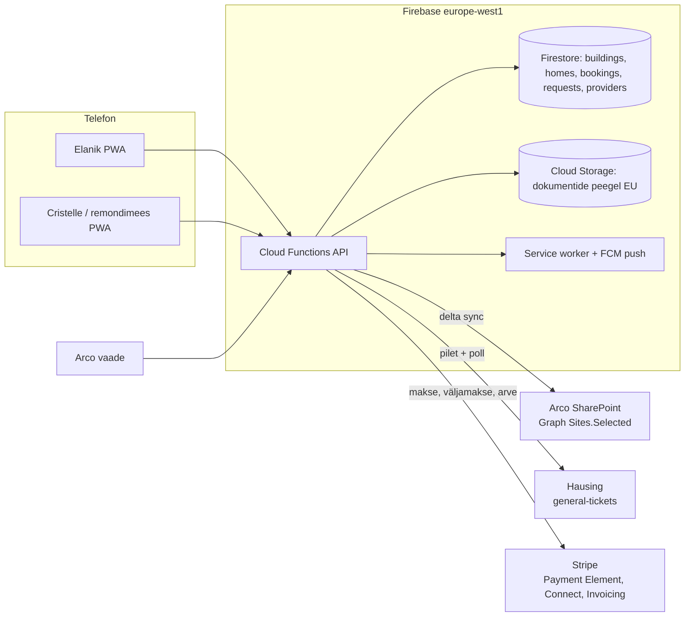

# SUKODA platvormiplaan 2026 — üks kodu, neli kätt

**Kuupäev:** 22.09.2026
**Eesmärk:** platvorm, millega Arco Vara annab Kodulahe (Iili 6/8/10) ja Spordi 3a/3b kodud üle SUKODA kaudu, Cristelle juhib oma tööd ja kliente telefonist, elanik saab kõik koduasjad ühest kohast. Valmimisel sõlmime esimese arendajalepingu.
**Tähtaeg, mis loeb:** Arco võtmed novembris–detsembris 2026. Leping/LOI tuleb allkirjastada oktoobri keskel, pilootkodud peavad töötama esimeste võtmete ajaks.

Plaan toetub kahele eelmisele vestlusele: [Arco portaali lihtsustus](424538e3-ad95-4265-b442-c7f9c89a7688) (21.09, infokülluse mahavõtmine, Ülevaade → „järgmine · vajab tähelepanu · mida sa vajad“, pöördumise kolm kuju) ja [Arco kodupass ja pakkumine](dc7a38aa-0ee9-4f1e-abea-98f90ccc7844) (22.09, dokumendid Arco SharePointi, 9 € + 5 €/kuu, Hausing, kaks raha teed, visiidikaart).

---

## Standard: milline rakendus see peab olema

SUKODA on lihtsalt kasutatav, loogilise UI ja ilusa UX-iga moodne rakendus, mille peale igaüks — elanik, Cristelle, Arco müügijuht, järelteenindus — ütleb esimesel avamisel: **„vau, kui läbimõeldud, see teeb mu elu nii palju lihtsamaks“.** See ei ole turunduslause, vaid vastuvõtukriteerium igale ekraanile. Mitte ükski funktsioon ei ole valmis, kui ta töötab, aga ei tekita seda tunnet.

Mida „vau“ päriselt tähendab, et seda saaks kontrollida:

| Tunne | Mida see ekraanil tähendab | Kuidas kontrollime |
|---|---|---|
| **„Ma saan kohe aru.“** | Ekraan avaneb ja on selge, mis see on ja mida siin teha. Üks pealkiri, üks peamine tegevus, mitte kunagi kaks võrdset nuppu kõrvuti. Ei ühtegi mõistet, mida peaks õppima (`sponsorCents`, „pöördumine“, „kanal“ jäävad koodi, mitte ekraanile). | 5-sekundi test: näita ekraani võõrale inimesele 5 s, küsi „mis see on ja mida sa siin teeksid?“. Kui ta kõhkleb — ekraan pole valmis. |
| **„See mõtles mu eest.“** | Rakendus teab, mis on järgmine, ja paneb selle ette: Cristelle’il hommikul tänane esimene kodu koos koodiga, elanikul homne visiit, Arcol järgmine üleandmine. Vormid on eeltäidetud kõigega, mida me juba teame (Arco kood toob nime, aadressi, kingituse). Kuupäevad pakutakse etteteatamise sees, mitte tühja kalendrit. | Iga vorm: loe kokku väljad, mida kasutaja peab ise täitma. Kui neid on rohkem kui 3, küsi, kust me ülejäänu juba teame. |
| **„Ma ei pidanud midagi otsima.“** | Kõik, mida ühe tegevuse jaoks vaja, on samal kaardil: visiidil kood + aadress + nimekiri + märkus; küsimusel vastus + dokument + „telli spetsialist“. Ei mingit „vaata sätetest“, „leiad kaustast“. | Teekonna-test: `koodi sisestus → esimene tellimus` ja `hommikune push → Tehtud` ei tohi nõuda üle 4 puute ega ühtki tagasi-nuppu. |
| **„See on ilus ja rahulik.“** | Palju õhku, üks kirjatüüp pealkirjadele (serif), üks tekstile (sans), üks aktsentvärv, kaardid ühe kujuga. Animatsioon ainult siis, kui see näitab, mis juhtus (kaart liigub tehtuks). Ei ühtegi ikooni ilma põhjuseta, ei ühtegi hoiatuskollast, kui midagi pole valesti. Töötab telefonil ühe käega — peamine nupp pöidla all. | `/design-review` + `lint:ui` roheline; ekraanil ei ole üle kolme kirjasuuruse ega üle kahe tekstivärvi peale musta. |
| **„See teeb mu elu lihtsamaks.“** | Iga ekraan võtab kasutajalt mõne kohustuse ära, mitte ei lisa: Cristelle ei helista enam koodi pärast, elanik ei otsi enam garantiikirja, Arco ei saada enam PDF-e e-kirjaga, järelteenindus ei kirjuta enam sama vastust kolmandat korda. | Iga uue ekraani kirjelduses plaanis on lause „selle pärast ei pea X enam Y-t tegema“. Kui seda lauset ei saa kirjutada, ekraani ei ehitata. |
| **„See lihtsalt töötab.“** | Avaneb sekundiga ka nõrga võrguga, ei kaota kunagi kirjutatud teksti, ei näita kunagi tehnilist veateadet, ei küsi kaks korda sama. Kui midagi ei õnnestu, ütleb inimkeeles, mis juhtus ja mida teha. | Väravad (`npm run check`) rohelised; `/verify` iga käitumismuutuse peale; ühtki `err.message` toorelt ekraanil. |

Kolm vastuvõtuküsimust, mille iga ekraan peab läbima enne deploy’d:
1. Kas selle saab veel lihtsamaks teha, ilma et midagi vajalikku kaoks? Kui jah — tee.
2. Kas Arco müügijuht julgeks seda ostjale võtmete üleandmisel ise näidata? Kui ei — ei ole valmis.
3. Kas Cristelle saaks seda kasutada kinnaste ja poole tähelepanuga, trepikojas seistes? Kui ei — ei ole valmis.

Võrdlusalus on Apple’i Wallet ja Airbnb võõrustaja äpp, mitte Dobu ega haldusfirma portaal. Kui kahtled, vaata, kuidas nemad teeksid — ja tee siis vähem.

---

## 0. Põhimõtted, millest ei taganeta

1. **Üks ekraan, üks järgmine asi.** Elanik avab rakenduse ja näeb esimesena seda, mis teda päriselt puudutab: tulev visiit, vastuseta küsimus, tähtaeg. Mitte menüüd, mitte statistikat („5 tegijat kodu juures“ ei tule kunagi tagasi).
2. **Iga roll näeb ainult oma lõiku.** Cristelle näeb tänase kodu ja nimekirja, mitte garantiid. Remondimees näeb tööd ja korruseplaani, mitte koristusgraafikut. Arco näeb üleandmist ja passi, mitte koristuse hindu. Haldur ei saa üldse rakendust — tema töö on Hausingus.
3. **Me ei ole ainus koht, kus asjad elavad.** Dokumendid jäävad Arco SharePointi (meil on peegel), rikked jäävad Hausingusse, raha on Stripe’is. Kui SUKODA kaob, kaob ainult graafik. See on müügiargument DoBu vastu, mitte tehniline detail.
4. **Elanik ei maksa portaali eest.** Arco maksab ukse, elanik maksab töö, mille ta ise tellib. Cristelle’i enda kliendilt komisjoni ei võeta.
5. **Kõik suhtlus toimub rakenduses, e-kiri ja push ainult teatavad.** Eilne probleem („vastad e-kirjale ja portaalis pole sisu“) lahendatakse lõplikult: iga teade viib rakenduse kaardile, vastamine käib seal.
6. **Viis teavitust, mitte voog.** Hommikune päev (tegijale), uus soov (tegijale), homne visiit (elanikule), rütmi tähtaeg (kellele määratud), pöördumise staatus (elanikule). Kõik muu on rakenduses nähtav, mitte saadetav.
7. **Üks hääl, üks kirjasuurus.** Disainisüsteem lukku (tüpograafia, värvid, kaardi kuju, nupp). Ükski uus ekraan ei too uut fonti ega uut lauset lehe äärde. Copy-reegel: iga lause vastab küsimusele „mida ma nüüd teen?“ — muidu maha.
8. **Ei ehita seda, mida turult saab.** Ei oma juturobotit, ei Arco piletilauda, ei App Store’i äppi, ei CRM-i, ei React-ümberkirjutust. Progressiivne veebirakendus olemasoleva `minu.html` / `haldus.html` peale.

---

## 1. Mis on täna olemas (millele ehitame)

| Tükk | Seis | Kus |
|---|---|---|
| Kliendiportaal (Ülevaade, Teenused vajadusgruppides, Kaust, Minu kodu, pöördumised issue/question/visit) | Töötab, eile lihtsustatud, ET+EN | `minu.html`, `functions/haldus.js` (portalHandlers) |
| Tegija töölaud (Ülevaade, Kalender, Kliendid, Pöördumised, Kokkuvõte, Konto) | Töötab, ainult ET, töölaua-suurune | `haldus.html`, `functions/haldus.js` (haldusHandlers) |
| Teenuste kataloog 6 kategoorias, kodu rütm (14 hooldusrida, intervallid 1–24 kuud, `doneBy: home/provider`), dokumentide kategooriad | Olemas, sisu kinnitatud | `functions/lib/haldus-core.js` |
| Graafik: korduvad visiidid, pühad, eemalolek, konfliktikontroll, cron 07:00 | Olemas | `haldus.js` `syncSchedule`, `generateScheduledVisits` |
| Meeldetuletused (rütm esmaspäeviti e-kirjaga, lilled 09:00) | Olemas, ainult e-kiri | `sendMaintenanceReminders`, `sendFlowerOrders` |
| Kood/kinkekaart → kodu (`/lunasta`), tegija kutsekaardid | Olemas | `lunasta.html`, lunastaHandlers |
| Stripe: pere püsitellimus, tegija plaanid 0/19/39 €, kinkekaardid | Olemas | `functions/index.js`, billing |
| Arco demo: Kodulahe kodu, garantiimeeskond töölaual (`enterprise` plaan), PDF-id | Olemas | `scripts/seed-arco-demo.js` |
| Hausingu liides (Keycloak client-credentials, `POST /v1/general-tickets/ai-categorized`, staatuse pollimine) | Olemas teises projektis, TypeScript | `../the-list-services/functions/api/_hausing.ts` |
| Magic-link sisenemine, token localStorage’is | Olemas; PWA-s iOS-il ei tööta (vt 3.1) | `minu.html`, `haldus.html`, `portalSessions` |

**Puudub täielikult:** manifest + service worker, push, sisenemine koodiga rakenduse sees, ühekordse töö makse portaalis, Stripe Connect väljamaksed, Arco ettemaks/„rahakott“, maja-objekt, SharePointi lugemine, kodupass, Hausingu relay siin projektis, tegija vaade inglise keeles, offline.

---

## 2. Toode: neli vaadet ühele kodule

### 2.1 Elanik (PWA, 4 sakki)

| Sakk | Sisu | Peamine tegevus |
|---|---|---|
| **Kodu** | Järgmine asi (visiit / vastus / maksmata rida) · Viimane visiit („Tehtud, Kristi, teisipäev: koristus, ahi, voodipesu“) · Kodu rütm lugemisvaates: mida koduhooldaja teeb ja millal järgmine | Üks nupp: *Teata probleemist* (rike/garantii — üks lause + foto) |
| **Telli** | Koristus (üks kord / rütm), lisad lülititena (lilled, voodipesu, aknad, kodumasinad), Remondimees, Garantii ja maja (küsimus / pöördumine) | Hind ekraanil enne makset; kuupäevad alates tegija etteteatamisest (Cristelle 14 p) |
| **Kaust** | Kodupass (küte, filter, vesi, elekter, garantii lõpp — iga fakt viitega faili leheküljele) · Dokumendid kategooriates (arendaja omad + enda lisatud) · *Küsi* — otsing dokumentidest, vastus koos allikaga, kui ei leia → pöördumine | Otsi, ava, lisa |
| **Minu** | Pere kontaktid, sissepääs (kood/võti, krüpteeritud), eemalolek, maksevahend, keel, teavitused, ekspordi kodu | Sea kord, unusta |

**Kodu rütm kuulub sellele, kes kodu hooldab.** Kui kodul on koduhooldaja, on rütm (ahi, nõudepesumasin, pesumasina filter, süvapuhastus, aknad…) tema oma: tema valib, mida ta selle kodu juures teeb ja kui tihti, meeldetuletus läheb talle tänasesse nimekirja ja tehtud märkimisega liigub tähtaeg edasi. Elanik näeb rütmi lugemisvaates („Kristi teeb: ahi iga 3 kuud, viimati 12.08“) ja ei sea midagi. Kui ta tahab midagi juurde, on see üks puude — *Soovin ka aknaid* — mis läheb Cristelle’ile soovina, mitte seadena. Tehniku read (ventilatsiooni filtrid, küte) kuuluvad määratud tehnikule, garantiiülevaatused arendaja järelteenindusele.

Ainult kodu, millel koduhooldajat ei ole (Arco elanik, kes koristust ei ole tellinud), saab vaikerütmi maja passist (filtrid 6 kuud, garantiiülevaatus 12 kuud…) ja meeldetuletuse endale; sealt saab ühe puutega tegija tellida. Hetkel, kui koduhooldaja tuleb, võtab tema rütmi read üle.

**Kood on kodu võti, mitte tühi kinkekaart.** Arco loob üleandmisel kodu (korter, ostja nimi, e-post, võtmete kuupäev) ja lisab kingituse; kood trükitakse kaardile. Ostja sisestab koodi → tema andmed on juba sees, ta kinnitab ainult, et on tema (kood + 6-kohaline kinnitus e-postile, et kaardi leidja ei avaks võõrast kodu). Kingitused on juba küljes — Kodu-ekraani esimene kaart on „Arco kinkis sulle 2 koristust ja remondimehe visiidi — vali esimene aeg“. Kõik muu tellib ja maksab ta ise samas Telli-vaates; kui kingitus katab rea, on rida null ja kaarti ei küsita. Tänane `/lunasta` küsib nime, e-posti ja aadressi; Arco koodil tulevad need kodult ette. Kolm kooditüüpi jäävad: üleandmiskood (Arco kodu), kutsekood (Cristelle’i klient või uus tegija), kinkekaart (ostetud visiidid ilma kodu ette loomata).

Arco elaniku esmaavamine (koodi sisestamise järel) küsib täpselt kolm asja: kus on voodipesu, milliseid lilli eelistad, kuidas tegija sisse saab. Rohkem mitte. Kingitused („Arco kinkis 2 koristust ja 1 remondimehe visiidi“) on Kodu ekraanil esimene kaart, kuni esimene aeg on valitud.

### 2.2 Cristelle ja remondimees (PWA, 5 sakki)

| Sakk | Sisu | Peamine tegevus |
|---|---|---|
| **Täna** | Kodud aja järjekorras (marsruut). Kaart: kell, aadress (avab kaardirakenduse), sissepääs (nähtav ainult visiidi aknas), elaniku number (üks nupp), **tänane nimekiri** = tellitud lisad + rütmi read, mis on tähtajas ja tema omad, püsimärkus (koer, jalanõud, masin), mida kaasa võtta (lilled) | *Tehtud* (+ vabatahtlik märkus/foto) → elanikule teade, rütm liigub edasi |
| **Kalender** | 14 päeva ette, päevad linnaosa kaupa, mahutavuse näit, pühad ja eemalolekud, lohista → aeg muutub ja elanik saab teate | Nihuta, tühista |
| **Kodud** | Oma kliendid + SUKODA saadetud, eristatult. *Lisa klient*: nimi, e-post, aadress, suurus, koristuse rütm, hind, sobiv nädalapäev → graafik tekib, klient saab koodi/lingi. Kodu kaart: märkused, sissepääs, **kodu rütm** (mida ta selle kodu juures teeb ja kui tihti: kataloogist lülititega, vaikeintervallid, viimati tehtud), ajalugu | Kutsu klient; sea kodu rütm |
| **Soovid** | Uued tellimused ja küsimused. *Kinnita* pakub esimese vaba aja etteteatamise sees; *Ütle ära* põhjusega; vestlus kaardil (mitte e-kirjas) | Kinnita / ära ütle / vasta |
| **Konto** | Tööajad ja -päevad, etteteatamine (vaikimisi 14 p), max kodusid päevas, linnaosad, hinnad (suuruse järgi + lisad), väljamaksed (Stripe Connect), plaan, keel ET/EN, teavitused | Sea kord |

Remondimees saab sama kuju, aga tema Täna-kaardil on: töö kirjeldus, elaniku foto, **korruseplaan** (see üks fail, mille Arco on majal plaaniks märkinud), vee peakraan ja elektrikilp passist, kood kehtib visiidi ajaks. Foto tehtud tööst jääb töö külge. Ta ei näe koristusgraafikut ega lepinguid.

Tegija teavitused: 07:00 hommikune päev („3 kodu, kaasa lilled Iili 8“), uus soov, rütmi tähtaeg tema omal real (läheb tänasesse nimekirja, mitte eraldi teatena), väljamakse laekus, soov ootab >24 h.

Töölaud jääb ka arvutis kasutatavaks (samad lehed, laiem paigutus). Kokkuvõte-sakk liigub Konto alla „Teenitud“ plokina.

### 2.3 Arco (veebivaade töölaual, `haldus.html` arendaja-režiimis, ei ole PWA-kriitiline)

- **Majad** → **Kodud**: Iili 6/8/10, Spordi 3a/3b; iga kodu staatus (loodud / kood saadetud / aktiveeritud / esimene tellimus).
- **Anna üle** (üleandmine): korter, ostja nimi, e-post, võtmete kuupäev → kood + prinditav kaart (QR). Garantii lõpp arvutub võtmete kuupäevast. Üks minut.
- **Kingitused**: maja või kodu peale N visiiti või € eelarve, kehtivus (nt 6 kuud). Arve Arcole kuu lõpus.
- **Dokumendid**: SharePointi ühenduse seis, passi ülevaatuse järjekord (järelteenindus kinnitab faktid enne, kui elanik neid näeb).
- **Aruanne**: aktiveeritud kodud, küsimused (vastatud passist / inimeselt), rikked Hausingusse, tellimused. Kuuaruanne e-kirjaga.

Arco garantii- ja majaküsimused liiguvad maja **suunamistabeli** järgi (vt 3.5): Hausingusse, e-kirjaga järelteenindusele või SUKODA töölauale. Arco ei saa teist piletilauda — see oli nende endi tingimus.

### 2.4 Operaator (admin, Marko)

Majad ja arendajad, tegijate määramine kategooria kaupa, kingituste ja eelarvete loomine, Hausingu/SharePointi seadistus maja kohta, väljamaksete ülevaade, eksport. Jääb `admin.html` sisse.

---

## 3. Arhitektuur ja võtmeotsused

### 3.1 PWA ja sisenemine

- **Üks rakendus, üks manifest** (`/manifest.webmanifest`, `start_url: /app`, `scope: /`). `/app` suunab salvestatud sessiooni järgi `/minu` või `/haldus`. Sisselogimisekraan on üks: *Sisesta kood või e-post*. Kood (Arco kaart, Cristelle’i kutse, kinkekaart) määrab rolli. Alternatiiv (kaks eraldi installi eri ikooniga) jääb tagavaraks, kui rollide segunemine tekitab segadust.
- **Sisenemine koodiga rakenduse sees, mitte lingiga.** iOS-il avaneb e-kirja link Safaris, mitte installitud rakenduses, ja nende localStorage on eraldi — täna toimiv magic-link jätaks installitud rakenduse tühjaks. Sama probleem on Google’i/Apple’i popup-sisselogimisel, ja Google nõuaks lisaks, et elaniku e-post oleks Google’i konto. Lahendus: e-post → 6-kohaline kood → sisestad rakenduses → pikk sessioon (90 p, pikeneb kasutamisel; auditi punkt 3 lahendatud samaga). Magic-link jääb brauseri jaoks alles.
- **Teisest korrast Face ID.** Pärast esimest sisenemist pakub rakendus ühe korra passkey’d (WebAuthn): edaspidi avaneb rakendus ühe Face ID / sõrmejälje puutega, võti sünkroonitakse iCloud Keychainis või Google Password Manageris. Google/Apple sisselogimine lisanupuna hiljem, kui keegi küsib; ukse põhi neist ei sõltu.
- **Service worker** (Workbox): app shell + tänane päev offline (tegija Täna-kaardid, kood, nimekiri, plaan); *Tehtud* ja märkus järjekorras, kui levi kaob trepikojas.
- **Push** FCM Web Push (VAPID) sama SW-s. iOS 16.4+ toetab installitud PWA-s. Luba küsitakse õigel hetkel (pärast esimest kinnitatud aega), mitte esimesel avamisel. E-kiri jääb alati paralleelseks kanaliks.
- **Install-vihje** ilmub pärast koodi sisestamist üks kord („Lisa avaekraanile“ + iOS-i juhis), mitte bänneriga igal avamisel.
- **Keel:** elaniku pool **ET + EN + RU** (Arco kodudes on kõik kolm tavalised, ilma RU-ta jääb osa elanikke ukse taha). Töölaud ET + EN, RU kui mõni tegija seda vajab. Tehniline muster: praegune `lang === 'et' ? … : …` on kahene ja kolmele keelele ei laiene — uued laused käivad lehe sõnastiku `T = { võti: { et, en, ru } }` ja `t('võti')` kaudu; vanad 724 ternaari on lintis külmutatud (arv tohib ainult langeda) ja migreeritakse ekraani kaupa sama sprindi sees, kui ekraani puututakse. Kirjad ja push: `{ et, en, ru }` objektid ja üks `pick(obj, lang)`, `order.lang` kannab elaniku valikut. Kataloogi 141 kaht keelt kandvat rida saavad `ru` sprindis 1 (üks tõlkepäev, mitte arendus).

### 3.2 Andmemudel (muudatused)

| Kollektsioon | Uus / muudatus | Miks |
|---|---|---|
| `buildings` (uus) | developerId, nimi, aadress, units[], `sharepoint {siteId, driveId, folderPath, lastDeltaToken}`, `hausing {companyId, buildingId, roomMap}`, `routes {warranty, building}`, manager {nimi, telefon, e-post}, passport (maja tase), floorPlans[], warrantyMonths (24) | Vastab eilsele „kes sisestab halduri numbri ja mis siis, kui haldusfirma vahetub“: maja tase, üks kord, kodud pärivad |
| `orders` → käsitleme kui **home** | + buildingId, unit, handoverAt, warrantyUntil, `sponsor {developerId, credits[], budgetCents, validUntil}`, passport (korteri erisused), `access {doorCode(krüpt.), keyHolder, notes}`, pushSubscriptions[], ownerKind: `provider-invited | sukoda | developer` | Kingitused, pass, kaks raha teed |
| `homes/{id}/documents` (alamkollektsioon, asendab 40-lingi massiivi) | source `sharepoint | upload | link`, mirrorPath, sha256, pages, indexedAt, category | Peegel, otsing, eksport |
| `homes/{id}/facts` | key (filter-size, heating, water-main, breaker, warranty-end…), value, sourceDocId, page, status `draft | approved`, approvedBy | Kodupass viidetega, järelteenindus kinnitab |
| `providers` | + `availability {days, hours, maxPerDay, leadDays, districts}`, stripeAccountId, payoutSchedule, pricing {bySize, extras}, lang, kind `cleaning | handyman | developer` | Ajaplaneerimine, väljamaksed |
| `bookings` | + checklist[] (lisad + rütmi read), photos[], completedNote, `payment {intentId, sponsorCents, residentCents, providerCents, feeCents}` | Visiidikaart, raha jälg |
| `serviceRequests` | + channel `desk | hausing | email`, hausing {ticketId, number, status, lastPolledAt}, thread[] | Rikke teekond, vestlus rakenduses |
| `payouts` (uus) | providerId, periood, summa, Stripe transferId, read | Läbipaistvus Cristelle’ile |

### 3.3 Raha

**Kaks teed, nagu eile kokku lepiti:**

| Tee | Kes maksab | Komisjon | Stripe kulu | Väljamakse |
|---|---|---|---|---|
| Cristelle’i oma klient (tema kutsega) | Kliendilt Cristelle’ile nagu seni, või soovi korral rakenduse kaudu | 0 % | Kui rakenduse kaudu: Stripe kulu läheb hinnast, SUKODA ei võta | — (või Connect, kui tahab) |
| SUKODA saadetud klient (Arco kood, avaleht) | Elanik rakenduses; Arco kingitus katab põhirea | 30 % SUKODA-le, Stripe kulu (~1,5 % + 0,25 €) SUKODA osast | Stripe | Connect Express, kord nädalas |
| Arco | 9 € avamine + 5 €/kodu/kuu × 24; kingituste pakid | — | Stripe Invoicing, kuuarve | — |

- **Stripe Payment Element** Apple Pay / Google Pay’ga (domeenikinnitus sukoda.ee). Lilled ja lisad ühe maksena visiidiga. Rütmi puhul kaart salvestatakse (SetupIntent), makse võetakse visiidi kinnitamisel, mitte kuu ette — elanik näeb alati, mille eest.
- **Kingituse loogika:** tellimusel arvutatakse `sponsorCents` (kingituse rida) ja `residentCents` (ülejäänu). Kui kingitus katab kõik, ei küsi me kaarti üldse. Arcole kuu lõpus arve kasutatud kingituste eest (mitte ette — nii ei jää tal kasutamata raha kinni).
- **KM ja raamatupidamine:** hinnad km-ga (24 %). Kui Cristelle on FIE ilma km-kohustuseta, on jaotus teine kui OÜ-ga — enne Connecti live’i otsus raamatupidajaga. Stripe Tax vajadusel.
- **Tegija plaanid** jäävad: 0 € kuni 3 kodu, 19 € kuni 20, 39 € piiramatult — ainult tema enda kutsutud kodud loevad. Arco ja SUKODA saadetud kodud plaani ei lähe.

### 3.4 Dokumendid ja kodupass

**Kaks faasi, üks andmemudel.** Dokument on alati `homes/{id}/documents` või `buildings/{id}/documents` rida väljaga `source: upload | sharepoint | link`. Elaniku Kaust, Küsi ja eksport loevad seda rida ega tea, kust fail tuli. Sellepärast saab A-faasis alustada üleslaadimisega ja B-faasis lisada SharePointi ilma, et rakenduses midagi muutuks.

**A-faas (Sprint 3): Arco annab, meie hostime, elanik näeb.**
- Arco vaates Majad → Iili 8 → *Dokumendid*: lohistab maja kausta (juhendid, kasutus- ja hooldusjuhend, plaanid, garantiitingimused, ühistu info) ühe korraga — kategooria tuleb failinimest või valitakse korraga kõigile; korteri erisused (korteri plaan, üleandmisakt) lisatakse kodu peale. Kõik selle maja kodud pärivad maja dokumendid.
- Failid Cloud Storage’is (EU), avanevad elanikule meie kaudu (`GET /api/me/documents/file` juba olemas), PDF brauseris õigel leheküljel. Üleslaadimine ja seed PDF-idega töötavad juba (`POST /api/me/documents/upload`, `scripts/seed-arco-demo.js`); juurde tuleb maja tase ja hulgi-üleslaadimine.
- Pass täidetakse käsitsi: järelteenindus kirjutab arendaja vaates maja faktid (küte, ventilatsioon, filtri mõõt, vee peakraan, kilp, garantii lõpp) ja märgib faili + lehekülje. 2 × 20 minutit.
- Arcole ütleme ausalt: „esimeses etapis laadite kausta meile, teises seote oma SharePointi ja haldate sealt“. Fail on ka A-faasis nende oma — eksport ja kustutamine on nende nupp.

**B-faas (jaanuar): Arco haldab oma keskkonnas, meie näitame.**

1. Arco IT registreerib (või annab nõusoleku) rakendusele Microsoft Graphis õiguse **`Sites.Selected`** ainult järelteeninduse saidile. Meil ei ole ligipääsu millelegi muule. See on lause, mida nende IT tahab kuulda.
2. Maja kaust → delta-sünk → **peegel** samasse Cloud Storage’isse, samad `documents` read, `source: sharepoint`. Uus fail SharePointis ilmub elaniku Kausta ilma, et keegi midagi teeks; kustutatud fail kaob. SharePoint on originaal; peegel on selleks, et vastus ei sõltuks nende lingist ja et eksport oleks võimalik. Elanik avab faili meie kaudu, sest tal ei ole Arco kontot. A-faasis üles laaditud failid jäävad alles või asendatakse SharePointi omadega — Arco valik maja kohta.
3. **Passi koostamine:** PDF-idest tekst (pdf.js / Document AI), Gemini 2.5 Flash tasulisel tasemel (andmeid ei treenita) tõmbab välja faktid koos faili ja leheküljega — **maja tase üks kord** (Iili ja Spordi: kaks lehte), korter pärib, korteri erisused eraldi. Järelteenindus kinnitab enne avaldamist (`facts.status: approved`). Vale kindel vastus kütte kohta on ohtlikum kui „seda juhendis ei ole“.
4. **Küsi:** elanik trükib küsimuse Kausta ülemisse kasti → üks vastusekaart kolme kihiga: **(a) fakt passist** („Systemair SAVE VTR 300 esikus, filtrid F7 + M5, 280×220×48, viimati 12.03“), **(b) koht dokumendis** („juhend, lk 14“ — avab PDF-i sel leheküljel meie kaudu), **(c) mida nüüd teha** — nupud tulevad automaatselt fakti seosest kataloogi ja rütmiga: *Telli tehnik* (`vent-filters`; garantiiajal `systems-tuning` garantii korras), *Tuleta meelde N kuu pärast* (rütmi rida sellele, kes kodu hooldab), *Küsi järelteeninduselt* (pöördumine maja suunamistabeli järgi, vastus samale kaardile). Kui leidu ei ole, on vastus aus „juhendites seda ei ole“ + üks nupp inimesele; kütte, elektri, vee ja gaasi teemadel alati lisaks „kui pole kindel, telli tehnik“. Ei ole juturobot, on otsing, mis vastab ja pakub järgmise sammu.
5. **Küsimused kasvatavad passi.** Iga küsimus salvestub maja tasemel; järelteenindus näeb korduvad küsimused ühes järjekorras ja lisab ühe fakti või lause maja passi → kõik selle maja kodud saavad edaspidi vastuse ilma inimeseta. Postkast väheneb iga kuuga.
6. **Ilma arendajata kodud** (Cristelle’i kliendid): dokumendid üleslaadimisena või lingina (Drive, Dropbox), samad kategooriad, sama Küsi; passi faktid kinnitab elanik ise.
7. **Eksport:** iga kodu kohta ZIP (dokumendid + pass PDF + ajalugu JSON) elaniku Minu-sakist ja Arco vaatest. Lepingulause: *failid jäävad teile, me loeme need korra läbi, lepingu lõpus saate kausta ja iga korteri passi välja.*

### 3.5 Rikked ja garantii (Hausing)

- Port `_hausing.ts` → `functions/lib/hausing.js`: Keycloak client-credentials (token ~300 s, cache), `POST /v1/general-tickets/ai-categorized`, `watcherEmail` = elaniku e-post, `buildingId/roomId` maja `roomMap`-ist, idempotentsus `clientRequestId`-ga. Staatust **pollime** iga 15 min avatud piletitel (Hausing veebikonkse ei saada); staatus ja lahendus kirjutatakse pöördumise kaardile → elanikule push. Manused 2. faasis (3-sammuline upload).
- **Suunamistabel maja kohta** (`buildings.routes`): `warranty: hausing | email | desk`, `building: hausing | email | desk`. Kuni Arco/haldur ei ole kliendi ID-d, saladust ja ettevõtte ID-d väljastanud, töötab `desk`/`email` (praegune käitumine). Võtmete saabudes lüliti ümber, koodi ei muudeta. Sama lüliti lahendab haldusfirma vahetuse.
- Rotermanni võti Arco maju ei ava — vajame Arco (või Kodulahe halduri) enda kolme väärtust. See on esimene asi, mida Arcolt küsida.

### 3.6 Turvalisus ja GDPR (Arco küsib)

- Sissepääsukoodid ja võtmeinfo krüpteeritud väljana (Cloud KMS), nähtavad ainult määratud tegijale visiidi aknas ±2 h; iga vaatamine logis.
- Andmetöötlusleping Arcoga (meie oleme volitatud töötleja dokumentide ja elanike andmete osas), andmed EL-is (europe-west1 juba), säilitusaeg ja kustutamine kodu eksporti järel.
- Auditi (`docs/PORTAL-AUDIT.md`) lahtised read: referrer-policy `no-referrer`, sessiooni pikendamine kasutamisel, rate-limit Firestore’i — kõik lähevad Sprint 1 sisse, sest sisenemine kirjutatakse niikuinii ümber.

### 3.7 Tehnoloogia suunad, mis võetakse algusest kaasa

- **API on tööriistad, mitte lehed.** Iga tegevus (loe kodu dokumente, küsi, telli koristus, telli tehnik, teata rikkest, sea rütm) on kodu-piiriline, idempotentne ja sõltumatu ekraanist. Rakendus kasutab neid nuppudena; jaanuaris pannakse sama komplekt välja **MCP-serverina**, et elaniku enda Claude või ChatGPT saaks ühe kodu ulatuses tegutseda. Tellimus ei lähe agendi lausest sisse — inimene kinnitab aja ja hinna rakenduses. Arcole on see lause „valmis agentide ajastuks“, meile null lisatööd, kui API on algusest nii tehtud.
- **Mudel on vahetatav.** Passi väljavõte ja Küsi kasutavad üht adapterit (`lib/answer.js`), mille taga on täna Gemini 2.5 Flash. Homme võib olla teine mudel; faktid ja viited jäävad meie andmemudelisse, mitte mudeli sisse.
- **Arve vorm Arcole.** E-arve on Eestis kohustuslik avalikule sektorile (2019) ja alates 1.07.2025 ostjale, kes on äriregistris e-arve vastuvõtjaks märgitud ja seda küsib. Sprint 0-s: kontrolli registrist, kas lepingut sõlmiv Arco üksus on e-arve vastuvõtja, ja küsi nende raamatupidamiselt arve vormi. Kui e-arvet on vaja, läheb kuuarve Meriti või e-arve operaatori kaudu; muidu piisab PDF-arvest. Stripe jääb igal juhul kaardimaksetele.
- **Jälgimine enne 122 kodu.** Cronide (07:00 graafik, 09:00 lilled, esmaspäeva rütm, Hausingu poll) ja API 5xx-vigade alarm e-postile/pushi (Cloud Monitoring või Sentry), Stripe webhookide ebaõnnestumiste alarm. Päev tööd Sprint 3-s.

### 3.8 Tehniline hügieen, et eilne ei korduks (olemas alates 22.09)

- **Reeglid agentidele** `.cursor/rules/` (Klaariksist kohandatud): `sukoda-session.mdc` (skoop, väravad, ET+EN, deploy-kontrollnimekiri, kokkuvõtte vorm), `portal-html.mdc` (üks hääl: `.p-h` / `.eyebrow` / `.p-btn`, tokenid, infotihedus, suhtlus rakenduses), `functions.mdc` (puhas loogika `haldus-core.js`-is, auth-skoop, raha, graafik, kirjad, cronid). Käsud `/review`, `/verify`, `/design-review` `.cursor/commands/`.
- **Väravad:** `npm run check` = `lint:ui` + `node --check` igale funktsioonifailile + `npm test`; jookseb automaatselt `npm run deploy*` sees ja GitHub Actionsis (`.github/workflows/ci.yml`).
- **Ühikutestid** `functions/test/` (`node:test`, sõltuvusteta): 27 testi graafikule, pühadele, eemalolekule, rütmile, kontaktidele, dokumentidele, plaanidele ja kataloogi ET+EN paarsusele. Iga muudatus `haldus-core.js`-is toob testi kaasa.
- **Drifti-ratšett** `scripts/ui-lint.js`: loeb toorest hexi, `text-[Npx]`, käsitsi tehtud eyebrow’sid, inline `lang === 'et'` ternaare (kahene muster, RU-d ei kanna), ühe keelega ternaare ja kataloogi kaht keelt kandvaid ridu (`noRuCore`) faili kaupa `scripts/ui-lint.baseline.json` vastu. Arv tohib ainult langeda; uus drift nurjab buildi ja nimetab faili ja rea. Tokenid `border-line`, `border-line-strong`, `text-muted-light` ja klass `.eyebrow` on `assets/css/main.css`-is olemas — uus kood kasutab neid, vana pühitakse ekraani kaupa sprintide sees.
- `minu.html` (2 500 rida) ja `haldus.html` (1 600 rida) jagatakse Vite’iga moodulitesse ainult selle ekraani ulatuses, mida sprint puudutab.
- Playwright suitsutestid neljale teekonnale (kood → kodu; telli → maksa; soov → kinnita → tehtud; rike → pilet) lisatakse Sprint 1 lõpus, kui PWA kest on olemas.
- Copy-kontroll enne deploy’d: iga uus lause elaniku poolel ET+EN+RU (`T`-sõnastikus), ilma turunduskeeleta rakenduse sees (`lint:ui` `emptyEn` ja `etOnlyCore` on nullis ja jäävad nulli; `ternary` ja `noRuCore` tohivad ainult langeda).

---

## 4. Ehitamise järjekord (10 nädalat)

Iga sprint lõpeb sellega, et asi on deploy’tud ja Cristelle või sina kasutate seda päriselt. Järjekord on vajaduse, mitte huvitavuse järgi: kõigepealt see, mida Cristelle ja elanik puutuvad iga päev, viimasena see, mis sõltub Arco võtmetest.

| Sprint | Nädalad | Valmis, kui | Toetub |
|---|---|---|---|
| **0. Otsused ja küsimused Arcole** | 22.–26.09 | Disainisüsteem lukus; Arcole saadetud: pakkumine (9 € + 5 €), kolm küsimust (SharePointi sait + Sites.Selected, Hausingu kliendi ID/saladus/ettevõtte ID või kinnitus, korterite ja ostjate nimekiri); Cristelle’iga kokku lepitud hinnad ja etteteatamine; raamatupidajaga KM-küsimus | — |
| **1. PWA kest ja sisenemine** | 29.09–10.10 | Manifest, SW, install-vihje; kood/e-post → 6-kohaline kood rakenduses; `/app` suunab rolli järgi; elaniku Kodu-ekraan „järgmine asi“; tegija **Täna** ja visiidikaart; **Tehtud** liigutab rütmi; push 5 tüüpi + e-kiri; töölaud EN; **keel**: `T`/`t()` muster sisse, keelevalik ET/EN/RU, `langOf`/`pick` kolmele keelele, kataloogi `ru` (141 rida), puututud elaniku ekraanid kolmes keeles | Praegune portaal ja töölaud, `maintenance`, cron |
| **2. Tellimine, raha, Cristelle** | 13.–24.10 | Telli: üks kord / rütm, lisad lülititena, kuupäevad etteteatamise sees, hind enne makset; Payment Element + Apple Pay; Connect Express Cristelle’ile, nädalane väljamakse, Teenitud-plokk; Konto: tööajad, etteteatamine, linnaosad, hinnad; **Lisa klient** + kutsekaart poleeritud; Soovid-vestlus rakenduses (e-kirja vastused enam sisu ei kaota) | Kataloog, Stripe, `partnerInvites` |
| **3. Maja, üleandmine, kingitused, Hausing** | 27.10–7.11 | `buildings` + suunamistabel; Arco vaade: Majad → Kodud → **Anna üle** (kood + QR-kaart PDF); elaniku esmaavamine 3 küsimusega; kingitused (N visiiti / € / periood), `sponsorCents` maksel, Arco kuuarve; Aruanne; **`lib/hausing.js`** The List Servicesi kliendist: token, `general-tickets/ai-categorized`, `watcherEmail`, `buildingId/roomId` maja kaardist, poll 15 min → pilet ja number pöördumise kaardil < 1 min; **dokumendid A-faas**: maja ja kodu `documents`, Arco vaates hulgi-üleslaadimine maja peale, kodud pärivad, PDF avaneb elanikule õigel leheküljel; pass käsitsi kahele majale | Lunasta-voog, seed, upload-API, `_hausing.ts`; Arco Hausingu võti (kuni tuleb: `desk`) |
| **4. Dokumendid B-faas ja pass** | 10.–21.11 → jaanuar | Graph Sites.Selected → delta-sünk → samad `documents` read `source: sharepoint`; Arco haldab kausta oma keskkonnas, elanik näeb muutust automaatselt; passi väljavõte faktidena viidetega (Iili ja Spordi maja tase); järelteeninduse kinnitusjärjekord; **Küsi** otsinguga ja „Saada inimesele“; eksport ZIP; elaniku pool tervikuna kolmes keeles (`ternary`-loendur `minu.html`/`lunasta.html` nullis) | Arco saidi õigus (Sprint 0 küsimus); A-faasi andmemudel |
| **5. Karastamine** | 24.11–5.12 | Hausingu manused (3-sammuline upload), remondimehe korruseplaan visiidil; koormustest 122 kodu; Playwright; GDPR-leping; jälgimine; esimeste võtmete tugi | — |

### MVP-lõige: mis peab töötama allkirja ja esimeste võtmete ajaks

Ühe inimese ja agentide jaoks on viis sprinti kümne nädalaga liiga tihe, kui kõik peab valmis olema enne lepingut. Sellepärast on kaks taset:

| Tase | Sisu | Tähtaeg |
|---|---|---|
| **A. Leping ja esimesed võtmed** | Sprindid 1–3 täies mahus + **Hausingu relay** (port `_hausing.ts` → `lib/hausing.js`, Arco võti ja maja/ruumi kaart sisse, staatuse poll; kuni võtmed tulevad, töötab sama pöördumine `desk` kanalil) + pass **käsitsi** kahele majale (järelteenindus täidab faktid arendaja vaates, 2 × 20 min) + Küsi lihtsa otsinguga passi ja dokumentide pealkirjade pealt | 7.11 |
| **B. Lepingu sees, jaanuariks** | SharePointi delta-sünk ja peegel, passi automaatne väljavõte viidetega, Hausingu manused, MCP-tööriistad | 31.01.2027 |

A-tase on valmis siis, kui need kaks teekonda töötavad telefonis algusest lõpuni, ilma sinu käeta vahepeal:

**Cristelle kasutab.** Sisestab kutsekoodi → rakendus avaekraanil → Konto: tööpäevad, etteteatamine, hinnad → Kodud: lisab oma kliendi (nimi, e-post, aadress, suurus, rütm, hind, nädalapäev) → graafik tekib, klient saab koodi → seab kodu rütmi (ahi, filtrid, süvapuhastus) → hommikul 07:00 push „täna 3 kodu“ → Täna: kaart koodi, nimekirja ja märkusega → *Tehtud* → elanik saab teate, rütm liigub → Soovid: kinnitab uue tellimuse aja → nädala lõpus näeb Teenitud. Tema klientidelt komisjoni ei võeta.

**Arco annab üle.** Arco vaates Majad → Iili 8 → *Anna üle*: korter, ostja nimi, e-post, võtmete kuupäev → kood + prinditav kaart → ostja sisestab koodi telefonis → rakendus avaekraanil → Kodu: kingitus „Arco kinkis 2 koristust“, garantii lõpp, kolm küsimust (voodipesu, lilled, sissepääs) → Kaust: maja dokumendid ja käsitsi täidetud pass → Telli: valib esimese koristuse aja, kingitus katab, lilled Apple Pay’ga → Cristelle kinnitab → küsimus filtri kohta saab vastuse passist, garantiipöördumine läheb järelteenindusele → Arco näeb Aruandes, et kodu on aktiveeritud.

Arco kuus „definition of done“ punkti (peatükk 5) täituvad A-tasemel. B on lepingusse kirjutatud etapp, mille tähtaeg sõltub ka nende võtmetest — see on aus ja kaitseb sind. Monoliitide moodulitesse jagamine käib ainult nende ekraanide ulatuses, mida sprint puudutab, mitte eraldi projektina.

**Väravad, kus päris inimene proovib:** Sprint 1 lõpus kasutab Cristelle Täna-vaadet nädal oma päris kodudega; Sprint 2 lõpus tellib ja maksab üks tema klient; Sprint 3 lõpus annab Arco järelteenindus ühe testkorteri ise üle ja üks nende inimene sisestab koodi oma telefonis. Ilma nende kolmeta ei lähe järgmine sprint käima.

**Kui Arco võtmed (SharePoint, Hausing) hilinevad:** Sprint 4 tehakse Arco poolt üleslaaditud kaustaga (arendaja vaates „Laadi maja kaust“) ja pass kirjutatakse järelteeninduse poolt käsitsi kahele majale — see on 2 × 20 minutit; Hausingu kood on Sprint 3-s valmis ja testitud Rotermanni võtmega, Arco maja lülitatakse `hausing`-kanalile päeval, kui nende kliendi ID, saladus ja ettevõtte ID käes on. Toode töötab, ühendused tulevad järele ilma koodi muutmata.

**Mis jääb pärast 5. sprinti:** QR-kaartide uus trükk (kui koodi tee on lõplik), avalehe plokk „Said kodu arendajalt?“, remondimehe otsimine ja leping, töölaud RU, `index.html` RU, manused Hausingusse, hinnangud pärast visiiti, teine koristaja Cristelle’i kõrvale.

---

## 5. Pakkumine Arcole (kokkuvõte, numbrid eilsest)

| Rida | Hind | Kes maksab |
|---|---|---|
| Kodu avamine | 9 €, üks kord | Arco |
| Portaal 24 kuud võtmetest: dokumendid, pass, Küsi, rikke saatmine, tellimine | 5 €/kodu/kuu | Arco |
| Iili 66 + Spordi 56 = 122 kodu | **15 700 €** (DoBu samal hulgal ~19 000 €, ilma tellimise ja garantiita) | Arco |
| Üleandmise kingitus (soovitus: 2 koristust + 1 remondimehe visiit, kehtib 6 kuud) | hinnakirja hind, arve kasutamisel | Arco |
| Koristus, lilled, remont, mis ei ole garantii | tegija hind, nähtav enne makset | Elanik (või Arco kingitus) |
| Garantii ja maja | Arco oma töövõtja, Hausingu või e-kirja kaudu | Arco |

Sulle jääb: 15 700 € peaaegu puhtalt (mudeli ja ketta kulu kümned eurod); iga SUKODA saadetud koristuse pealt ~65–70 € (30 % miinus Stripe); kingituste pealt sama jaotus. Lagi, kui iga neljas kodu jääb 1× kuus rütmi: ~65 000 € kahe aasta peale.

Lause laua taha: *Viis eurot kodu kohta kuus, kaks aastat, pluss üheksa eurot avamine. Elanik ei maksa. Dokumendid jäävad teie SharePointi, me loeme need korra läbi ja vastame elanikule allikaga. Rike jõuab teie haldurile Hausingusse ja staatus tuleb inimesele tagasi. Koristuse ja remondi saab samast kohast, töö maksab tellija või teie kingitusena. Lepingu lõpus saate kausta ja iga korteri passi välja.*

**Mida Arco näeb lepingu allkirjastamisel (definition of done):**
1. Anna üle ühe korteri ühe minutiga, kaart koodiga prindib.
2. Ostja sisestab koodi telefonis, rakendus on avaekraanil, näeb kodu, kausta, kingitust.
3. Küsimus filtri kohta saab vastuse leheküljega; küsimus, mida juhendis pole, läheb järelteenindusele.
4. Rike ühe lausega → Hausingu piletinumber tagasi (või töölaua kaart, kui võtmeid veel pole).
5. Koristus tellitud, kingitus kattis, lilled makstud Apple Pay’ga, Cristelle kinnitas telefonist.
6. Eksport ühe kodu kohta töötab.

---

## 6. Mõõdikud, mille järgi otsustame

| Mõõdik | Siht piloodis |
|---|---|
| Koodi aktiveerimine 7 päeva jooksul võtmetest | ≥ 80 % |
| Rakendus avaekraanil (install) aktiveerinutest | ≥ 60 % |
| Küsimused, mis said vastuse passist ilma inimeseta | ≥ 70 % |
| Rike → piletinumber | < 1 min |
| Soov → Cristelle’i kinnitus | < 24 h |
| Kodud, kes tellisid vähemalt ühe töö 3 kuu jooksul | ≥ 25 % |
| Elaniku tugipöördumised rakenduse enda kohta | ≈ 0 (kui tuleb, on ekraan vale) |

---

## 7. Riskid ja mis neid katab

| Risk | Kate |
|---|---|
| iOS PWA ei jaga Safari sessiooni | Koodiga sisenemine rakenduse sees (Sprint 1) |
| Arco IT ei anna Graphi õigust õigel ajal | `Sites.Selected` küsib ainult üht saiti; tagavaraks üleslaadimine ja käsitsi pass kahele majale |
| Hausingu võtmed hilinevad | Suunamistabel `desk`-il, lüliti ilma koodita |
| Nov–dets tuleb võtmeid kümneid korraga, Cristelle’i päevad täis | 14 p etteteatamine; kingitus kehtib 6 kuud; teine koristaja kutsekaardiga; max kodusid päevas Konto all |
| Kaks 2 000-realist HTML-monoliiti murduvad igal muutusel | Vite-moodulid, tokenid, Playwright neljale teekonnale |
| Sisu läheb jälle „kirjuks“ | Copy-reegel („mida ma nüüd teen?“), üks hääl, ülevaatus enne deploy’d |
| KM ja väljamaksed FIE-le | Raamatupidaja otsus Sprint 0-s, enne Connecti |
| Sissepääsukoodid lekivad | KMS, ajaaken, logi |
| Elanik ei leia „vana“ e-kirjavastust | Vestlus ainult rakenduses, e-kiri teatab ja viib kaardile |

---

## 8. Erijuhud, mis peavad töötama (muidu on esimene kuu tugipostkast)

| Juhtum | Kuidas lahendame | Millal |
|---|---|---|
| **Korter müüakse** | Minu → *Anna kodu üle*: uus omanik saab koodi, kodu (dokumendid, pass, rütm, ajalugu) jääb; eelmise omaniku kontaktid, sissepääs, maksevahend ja pöördumised eemaldatakse. Arco kodul jääb portaal tasuta ka uuele omanikule. | Sprint 3 |
| **Korter antakse üürile** | Omanik lisab üürniku rolliga `tenant`: näeb rütmi, tellib ja maksab ise, teatab rikkest; ei näe omandidokumente ega saa kodu üle anda. Omanik näeb kõike. | Sprint 3 |
| **Ühel inimesel mitu kodu** | Sama e-post, kodude valik Minu all; teavitused kodu nimega. | Sprint 1 (sessioon juba e-posti-põhine) |
| **Cristelle haige või puhkusel** | Konto → eemalolek; visiidid nihkuvad automaatselt ja elanik saab ühe teate; SUKODA saadetud kodudel võib operaator määrata asendaja. | Sprint 2 |
| **Elanik ei ole kodus, kood ei tööta** | Tegija märgib *Ei saanud sisse* → elanikule teade, uus aeg pakutakse; tühisõidu tasu (kui on) on kirjas enne makset ja võetakse ainult SUKODA saadetud töödel. | Sprint 2 |
| **Hiline tühistamine, tagasimakse** | Reegel ekraanil enne makset (nt tasuta kuni 24 h ette); tagasimakse Stripe’i kaudu ühe nupuga operaatoril; kingitusest võetud rida läheb kingitusse tagasi. | Sprint 2 |
| **Kahju visiidi ajal** | Tegija foto + märkus töö küljes; pöördumine operaatorile; tegija vastutuskindlustus on partnerlepingus (`PARTNERLEPING_NAIDIS.md`). | Sprint 2 |
| **Avarii öösel** | *Teata probleemist* esimene rida on maja 24h avariinumber (buildings.manager / avariinumber), alles siis vorm. | Sprint 1 |
| **Kingitus lubab tegijat, keda pole** | Kingituse rida saab luua ainult kategoorias, millel on maja jaoks määratud tegija. Remondimehe kingitus tuleb pakkumisse alles siis, kui remondimees on olemas. | Sprint 3 |
| **Kaart kadus, kood lekkis** | Arco vaates *Väljasta uus kood* — vana kaotab kehtivuse; aktiveeritud kodu koodi enam ei vaja. | Sprint 3 |
| **Kaart aegus rütmi maksel** | Makse võetakse kinnitamisel, mitte ette; ebaõnnestumisel teade elanikule ja visiit jääb ootele, mitte ei kao. | Sprint 2 |
| **Arco lõpetab maksmise** | Kodu jääb elanikule tasuta; pass ja peegel alles; ainult arendaja vaade suletakse. | Leping |
| **Cristelle lahkub platvormilt** | Tema kutsutud kodud on tema omad: ekspordib kliendid ja ajaloo; SUKODA saadetud kodud saavad uue tegija. | Sprint 2 |
| **Garantii lõpeb 24 kuud pärast võtmeid** | Garantii-kategooria kaob Telli-vaatest, asemele „Tehnik“; rütmi read jäävad; üks teade elanikule kuu enne. | Sprint 3 |

## 9. Mida me teadlikult ei tee

Oma juturobot persoonaga; Arco veateadete töölaud; App Store / Play; CRM ja müügitoru tarkvara; kuutasu elanikult; React/Next ümberkirjutus; dokumentide ainus koopia meie serveris; halduri kasutajakonto; teenuste kataloogi kasvatamine enne, kui tellimise vaade on puhas.

---

## 9. Otsused, mis on sinu teha enne Sprint 1

1. Üks install rolliga koodist (soovitus) või kaks eraldi rakendust (Elanik / Töölaud)?
2. Komisjon SUKODA saadetud tööl: 30 % (eilne) — kinnita või muuda.
3. Cristelle: OÜ või FIE, km-kohustus? Määrab Connecti jaotuse.
4. Arco garantii tee vaikimisi: Hausing (kui järelteenindus seal töötab) või e-kiri + töölaud?
5. Üleandmise kingituse sisu, mida pakkumisse kirjutame (soovitus: 2 koristust + 1 remondimehe visiit, 6 kuud).
6. ~~RU keel piloodis või hiljem?~~ — otsustatud 22.09: elaniku pool ET/EN/RU piloodist alates, töölaud ET/EN.
